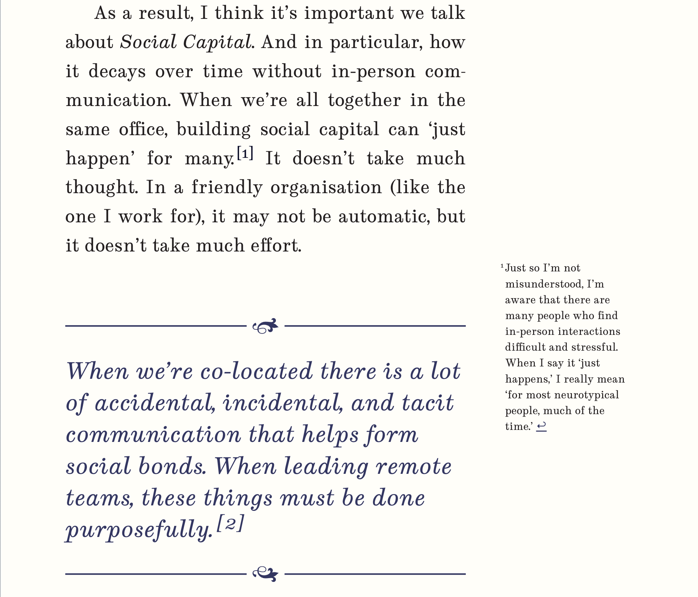

# Rehype sidenotes

This plugin takes <abbr title="Github Flavoured Markdown">GFM</abbr> or Multimarkdown-style
footnotes and converts them into sidenotes. That is, it places them inline with the document
content. This way (if you choose) you can float them into a margin.

Go from boring old footnote lists at the bottom of your page like this:


To exciting inline sidenotes like this:




## Installation

```
npm i -D @jrsinclair/rehype-sidenotes
```

## Usage

```javascript
import rehype from "rehype";
import sidenotes from '@jrsinclair/rehype-sidenotes';
import { unified } from "unified";

unified()
  .use(rehypeParse, { fragment: true })
  .use(sidenotes)
  .process(`<main>
    <div>
      <p>This is some text.</p>
      <p>This is some text with a footnote ref.<sup><a id="user-content-fnref-1" href="#user-content-fn-1">1</a></sup></p>
    </div>
    <section data-footnotes="" class="footnotes">
      <ol>
        <li id="user-content-fn-1"><p>This is the footnote.</p></li>
      </ol>
    </section>
</main>`);
```

### Input

```html
<main>
  <div>
    <p>This is some text.</p>
    <p>This is some text with a footnote ref.<sup><a id="user-content-fnref-1" href="#user-content-fn-1">1</a></sup></p>
  </div>
  <section data-footnotes="" class="footnotes">
    <ol>
      <li id="user-content-fn-1"><p>This is the footnote.</p></li>
    </ol>
  </section>
</main>
```

### Output

```html
<main>
  <div>
  <p>This is some text.</p>
  <p>This is some text with a footnote ref.<sup><a id="user-content-fnref-1" href="#user-content-fn-1">1</a></sup></p>
  <aside class="Sidenote" id="user-content-fn-1" role="doc-footnote">
    <p><small class="Sidenote-small"><sup class="Sidenote-number">1&thinsp;</sup>This is the footnote.</small></p>
  </aside>
  </div>
</main>
```

## License

[MIT](./license), © [James Sinclair](https://jrsinclair.com).

